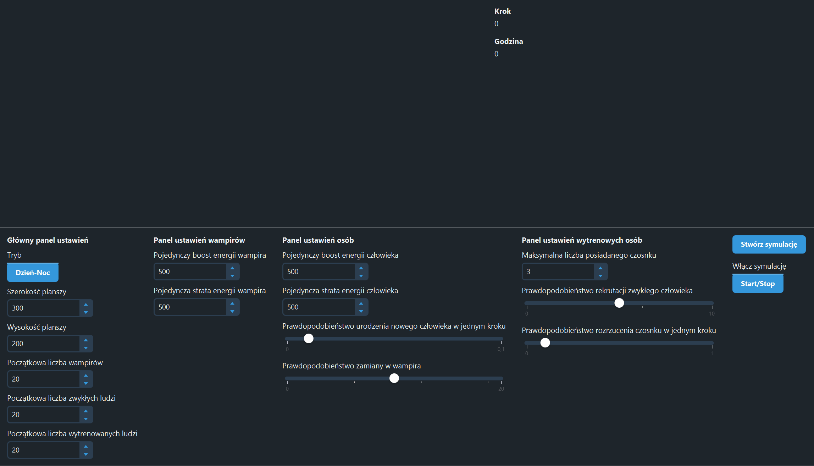

# Projekt-Programowanie-Obiektowe
Projekt programowania obiektowego "Symulacja wampirów".
<br><br>
## 🚀 Szybki start (Quick Start)

### Wymagania wstępne
* JDK 21
* Maven

### Uruchomienie w 3 krokach

Otwórz terminal i wykonaj następujące polecenia:

```bash
# 1. Sklonuj repozytorium
git clone https://github.com/juniorofyours/Projekt-Programowanie-Obiektowe.git

# 2. Wejdź do katalogu projektu
cd Projekt-Programowanie-Obiektowe

# 3. Zbuduj i uruchom aplikację
mvn compile javafx:run
```
<br>

## 💻 Przykładowe działanie (Sample Run)

Po pomyślnym uruchomieniu aplikacji zobaczysz okno symulacji

### Interfejs Graficzny (Inicjalizacja i uruchomienie symulacji)


*Możesz dynamicznie zmieniać parametry takie jak "Prawdopodobieństwo na zamianę w wampira" za pomocą suwaków w trakcie trwania symulacji,
aby móc przetestować nowe parametry dla pojawiających się agentów*

### Logi z przebiegu symulacji w konsoli
W terminalu aplikacja na bieżąco informuje o wydarzeniach z symulacji

```text
Krok: 38, godzina: 0.76
-Krok agenta nr.0 (Vampire) [ 0 3 ]
-Krok agenta nr.1 (Vampire) [ 3 3 ]
-Krok agenta nr.2 (Human) [ 4 2 ]
-Krok agenta nr.3 (Human) [ 3 3 ]
<<Atak wampira na czlowieka>>
<<Smierc czlowieka>>
```